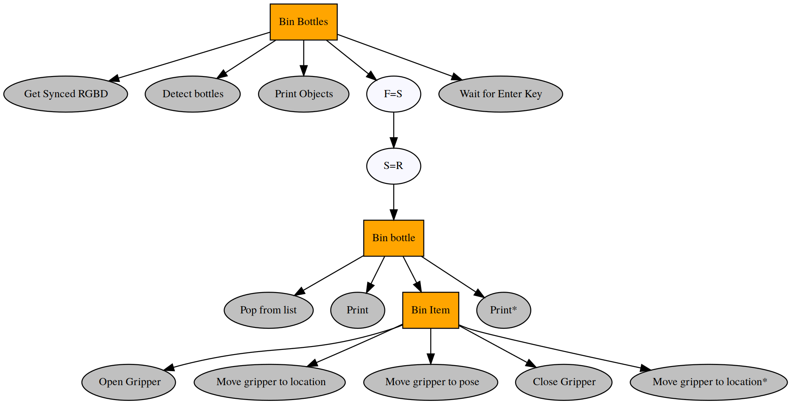
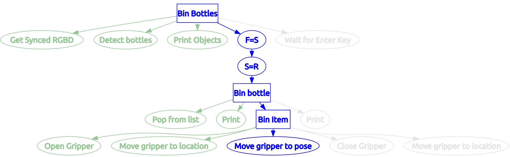

# RV Tasks Package

The RV Tasks package is where we define all of the tasks our robots are capable of performing. Tasks are written in a robot agnostic way from a software perspective, with specific robot hardware capabilities being the only factor limiting a robot from specific tasks (we haven't yet figured how to make an armless mobile base pick up a coffee...). 

A **task** refers to something distinct we want the robot to do, often requiring purposeful interweaving of many distinct components; components which often come from many different internal and external authors. Bringing software together from different research areas, with different authors, and different conventions is a process typically associated with a lot of pain. To manage this, we break completing a task up into some isolated concepts and software components which are described in detail below. 

## What does it mean to define a solution to a task

Three components combine to form a solution for a robot task:

- **capabilities**: are what functionalities required from the robot to complete the task (e.g. moving the arm to a pose, driving to a pose, detecting objects, saying a string, etc.),
- **sub-behaviours**: define how a group of capabilities combine in a way that is reusable for a wide variety of tasks (examples: picking up an object, asking a question, going through a door, etc.), and
- **behaviours**: are the cumulative definition for how a robot can apply its available capabilities to complete a given task (e.g. voice-controlled manipulation demo on the tabletop panda arm, going and making a coffee for a user, emptying all of the garbage bins, etc.).

The distinction between sub-behaviour and behaviour can often be confusing, and is somewhat arbitrary. A good rule of thumb is if the behaviour you are creating is too general to be locked down to a single tree (i.e. can be parameterised and would apply to a number of different tasks), and it requires the combination of too many distinct re-usable parts to be a single robot capability, then it should be a sub-behaviour.

We use **behaviour trees**, a common tool in the AI community for over a decade (originally being developed for the Halo games), to define the behaviour required for a robot ti complete a task. Unsurprisingly given the name, behaviour trees define an entire agent behaviour using a tree structure consisting of nodes and edges. Nodes correspond to one of the agent's defined capabilities, and edges define a parent that controls when & how the node is called. More information on how behaviour trees work can be found in the resources section at the bottom of the page.

Behaviour trees have a number of advantages over Finite State Machines (FSM), which are what is typically employed in robot systems. The main advantage applicable for our robots is behaviour trees allow us to detach behaviour (how bits of functionality combine together to do something meaningful) from functionality (things a robot can do). Detaching behaviour from functionality means that robot capabilities can be re-used across any task, and complex behaviours can be created without worrying about implementation details, and developers can focus on one part at a time (i.e. giving a robot a useful capability, or making the robot solve a meaningful task). For example, the functionality to detect whether a door is open or closed can be implemented once, then re-used in a plethora of behaviours (waiting for a door to be opened, waiting for a door to be closed, checking if a door is closed, only opening the door if it is closed, etc.) simply by changing the structure of the tree.

We implement a solution for task with a behaviour tree by mapping the 3 components above to distinct parts of a tree:

- a **leaf** wraps a functionality of the robot, defining how the tree executes the capability and receives the result once complete,
- a **branch** is a re-usable tree sub-section encapsulating a parameterisable behaviour which could be reused across multiple different tasks, and
- a **tree**, as mentioned above, is the definition of how a robot can interleave its capabilities to solve a task.

Solving a task boils down to 3 tightly coupled steps which can be done in any order:

- Writing leaves for each of the required robot capabilities (this step requires you to break down the task into what capabilities the robot requires to complete the task)
- Defining re-usable branches to solve repeated / reusable sections of the task (sometimes your task may not require this, but it always helps to define branches if you think they would be useful for another task)
- Writing a tree for the behaviour that solves the task (often when completing this step, you will end up having to go back and add parts to the previous steps)

All this seems pretty abstract and "hand-wavey", but there is a full example below of how the above principles can be applied to solve a non-trivial task.

## Quick & Easy: Solving a task with a tree

Here's the 1,2,3 TL;DR for creating a tree to solve a task:

1. Create some leaves:

        #!python
        from rv_trees.leaves_ros import ActionLeaf, ServiceLeaf

        class DeriveSolution(ServiceLeaf):
            def __init__(self, *args, **kwargs):
                super(DeriveSolution, self).__init__(service_name="/derive_solution", *args, **kwargs)

        class ApplySolution(ActionLeaf):
            def __init__(self, *args, **kwargs):
                super(DeriveSolution, self).__init__(action_namespace="/apply_solution", *args, **kwargs)

2. Join the leaves up in a tree that solves a task:

        #!python
        from py_trees.composite import Sequence
        from rv_trees.trees import BehaviourTree

        my_tree = BehaviourTree("Solve Task", Sequence("Solve", [DeriveSolution(), ApplySolution()]))

3. Run the tree:

        #!python
        my_tree.run(hz=30)

Other helpful commands:

- Showing an interactive tree with `rqt`:

        #!bash
        rqt_py_trees

- Printing trees interactively in the terminal:

        #!bash
        rosrun py_trees_ros py-trees-tree-watcher

- Printing blackboard variable values interactively:

        #!bash
        rosrun py_trees_ros py-trees-blackboard-watcher

- Getting a static GraphViz graphic for your tree:

        #!python
        from rv_trees.trees import BehaviourTree
        # Create your tree in a variable called 'my_tree'
        my_tree.visualise()

## Conventions & best practices

Below are some conventions & best practices we encourage everyone to use. This package is meant to help everyone's robots, so doing things in a consistent & robust way will maximise the benefit for your colleagues:


## Sharing is Caring: What ready-made leaves are available?

TODO.... include an auto generated table of existing leaf definitions


## Example: Placing all visible bottles in the bin

Lets step through how we would solve this task with a behaviour tree, where the task has the formal definition: 

    A tabletop manipulator must place all bottles in its visible workspace into the adjacent bin. The manipulator has the following ROS capabilities available for completing the task:

    - A ROS Service for getting a synced pair of RGB & depth images (service name: `/service/get_synced_rgbd`),
    - A ROS Service to detect bottles, returning a list of detected bottles (service name `/service/detect_bottles`),
    - A ROS Action Server to actuate the gripper (action namespace: `/action/actuate_gripper`), and
    - ROS Action Servers to move the gripper to either a pose (available: `/action/move_gripper/pose`) and or named locaction `workspace` & `bin` (available: `/action/move_gripper/location`).

Full working code for this example can be found in the `examples/` directory. `bottle_binner_backend` has dummy implementations of the required robot capabilities, with `bottle_binner_tree` containing everything tree related (which is stepped through below). Want to run this example on a real robot? Simply find a robot with the capabilities mentioned above, start-up the capabilities, and run the same `bottle_binner_tree` code. That's the strength in using trees to detach behaviour from capability, it naturally transfers across machines & robots!

### Part 1: Declaring a robot capability (writing a leaf)
The good news is [rv_trees](https://bitbucket.org/acrv/rv_trees/src/master/) has implemented leaves for you; all you have to do is instantiate, override, and expand the existing leaves to provide your new robot capability. Full documentation of the base leaves is in the [README](https://bitbucket.org/acrv/rv_trees/src/master/). All that's required to create a leaf in most cases is to simply provide some arguments to a base leaf constructor. For example, creating a leaf to actuate the gripper is as simple as:

```python
from rv_trees.leaves_ros import ActionLeaf

actuate_gripper_leaf = ActionLeaf("Actuate Gripper", action_namespace='/action/actuate_gripper')
```

All that's needed is a leaf name, and the namespace of ROS Action Server! A lot of assumptions are made under the hood in the `rv_trees` package, assumptions that may not always match your use case, so it is important to understand these assumptions for cases where you need to adjust them. 

The first assumption being made is around inputs and outputs. Leaves typically need an input (e.g. a goal pose is needed for a leaf moving a robot to a pose), provide an output (e.g. the e-stop state is returned by a leaf the robot's e-stop), or both (e.g. a leaf detecting grasp poses takes in RGB-D images & outputs the found grasp poses). A number of constructors arguments in the `Leaf` class exist to control how a leaf handles input & output. A much too broad summary (see [rv_trees](https://bitbucket.org/acrv/rv_trees/src/master/) for full details) is **load_\*** parameters control input, & **save\*** parameters control output. The default behaviour of leaves is to try to form input data from whatever was last saved from a previous leaf, & save output data if the **save** argument is set. 

Let's address one of our use cases, opening & closing the gripper, by rolling back some input assumptions. Static input data is needed to tell the gripper to open; i.e. a leaf for opening the gripper will always have the same input data commanding the ROS Action Server. To provide static input data instead of attempting to dynamically load input at runtime, we use the **load_value** constructor argument:

```python
from rv_msgs.msg import ActuateGripperGoal
from rv_trees.leaves_ros import ActionLeaf

open_gripper_leaf = ActionLeaf("Actuate Gripper",
                               action_namespace='/action/actuate_gripper',
                               load_value=ActuateGripperGoal(
                                   mode=ActuateGripperGoal.MODE_STATE,
                                   state=ActuateGripperGoal.STATE_OPEN))
```

The static data is of type `ActuateGripperGoal` which is defined in the [rv_msgs](https://bitbucket.org/acrv/rv_msgs/src/master/) package. The `action` & `service` definitions in the package ensure everyone's robots & components speak in the same format when talking to each other. For this reason it is crucual to only use definitions from `rv_msgs` when creating shared leaves; remember sharing is caring! 

Up to this point we have defined leaves as creating a single class instance of a base leaf from [rv_trees](https://bitbucket.org/acrv/rv_trees/src/master/), which is fine for leaves only used once, but if we want to make leaves to be used multiple times in a tree, exist across different trees, expanded upon, override default leaf behaviour, provide custom functions, and lots more...; using inheritance with class definitions makes a lot more sense. Creating re-usable leaves for opening & closing the gripper looks like:

```python
from rv_msgs.msg import ActuateGripperGoal
from rv_trees.leaves_ros import ActionLeaf


class _ActuateGripper(ActionLeaf):

    def __init__(self, *args, **kwargs):
        super(_ActuateGripper,
              self).__init__(action_namespace='/action/actuate_gripper',
                             *args,
                             **kwargs)


class OpenGripper(_ActuateGripper):
    OPEN_GOAL = ActuateGripperGoal(mode=ActuateGripperGoal.MODE_STATIC,
                                   state=ActuateGripperGoal.STATE_OPEN)

    def __init__(self, *args, **kwargs):
        super(OpenGripper, self).__init__("Open Gripper",
                                          load_value=OpenGripper.OPEN_GOAL,
                                          *args,
                                          **kwargs)

class CloseGripper(_ActuateGripper):
    CLOSE_GOAL = ActuateGripperGoal(mode=ActuateGripperGoal.MODE_STATIC,
                                    state=ActuateGripperGoal.STATE_CLOSED)

    def __init__(self, *args, **kwargs):
        super(CloseGripper, self).__init__("Close Gripper",
                                           load_value=CloseGripper.CLOSE_GOAL,
                                           *args,
                                           **kwargs)
```

Adding leaves for moving to poses & named locations is the same process as above:

```python
from rv_trees.leaves_ros import ActionLeaf

class MoveGripperToPose(ActionLeaf):

    def __init__(self, *args, **kwargs):
        super(MoveGripperToPose,
              self).__init__("Move gripper to pose",
                             action_namespace='/action/move_gripper/pose',
                             *args,
                             **kwargs)


class MoveGripperToLocation(ActionLeaf):

    def __init__(self, *args, **kwargs):
        super(MoveGripperToLocation,
              self).__init__("Move gripper to location",
                             action_namespace='/action/move_gripper/location',
                             *args,
                             **kwargs)
```

Now that we have some re-usable leaves, next up let's add leaves to detect bottle from the robot's camera images. This requires first calling the ROS service for getting synced RGB-D images, then passing the result onto the bottle detection service, and finally storing all detections in a persistent location for use later. The leaves are very similar to our leaves above, we just use a Service Leaf instead:

```python
from rv_trees.leaves_ros import ServiceLeaf

class GetSyncedRgbd(ServiceLeaf):

    def __init__(self, *args, **kwargs):
        super(GetSyncedRgbd,
              self).__init__("Get Synced RGBD",
                             service_name='/service/get_synced_rgbd',
                             save=True,
                             *args,
                             **kwargs)

class DetectBottles(ServiceLeaf):

    def __init__(self, *args, **kwargs):
        super(DetectBottles,
              self).__init__("Detect bottles",
                             service_name='/service/detect_bottles',
                             save=True,
                             *args,
                             **kwargs)

```

Enabling the **save** flag tells both leaves to save their results for the next leaf to get by simply loading the "last result". For this task, we don't want to save the list of detected bottles in last result, but instead save them to a key so they don't get overwritten when another leaf saves to "last result". We could hardcode the key name in the `DetectBottles()` class here, but then everyone who ever uses the detector leaf will have no control over where the data is saved. Instead, we will set the key name at the instance level in our task when we create our tree (i.e. call `DetectBottles(save_key=<MY_KEY_NAME>)` when instantiating the leaf in our tree).

Lastly, let's add some basic ROS-free leaves that print a detected objects list and pop (i.e. consume) an item from a list. We have already looked at input and output to a leaf, but these tasks will need us to adjust the processing part of the lifecycle; i.e. defining how a leaf gets a result from the input by providing a `result_fn` to the constructor. For the `ActionLeaf` & `ServiceLeaf` classes used above, their `result_fn` is already written for us which calls the Action Server / Service with the leaf input data & return the response as the leaf output data. 

```python
import rv_trees.data_management as dm
from rv_trees.leaves import Leaf

class PrintObjects(Leaf):

    def __init__(self, *args, **kwargs):
        super(PrintObjects, self).__init__("Print Objects",
                                           result_fn=self._print_objects,
                                           *args,
                                           **kwargs)

    def _print_objects(self):
        if self.loaded_data is None or not self.loaded_data:
            print("The detector found no objects!")
        else:
            print(
                "The detector found %d objects at the following coordinates:" %
                len(self.loaded_data))
            for o in self.loaded_data:
                print(
                    "\t'%s' of pixel dimensions %dx%d @ top left coordinates:"
                    " (%d,%d)" %
                    (o.class_label, o.width, o.height, o.x_left, o.y_top))

        return True

class PopFromList(Leaf):

    def __init__(self, pop_position=0, *args, **kwargs):
        super(PopFromList, self).__init__("Pop from list",
                                          result_fn=self._pop_item,
                                          *args,
                                          **kwargs)
        self.pop_position = pop_position

    def _pop_item(self):
        if not self.loaded_data:
            return None
        item = self.loaded_data.pop(self.pop_position)
        if self.load_key is not None:
            dm.set_value(self.load_key, self.loaded_data)
        else:
            dm.set_last_value(self, self.loaded_data)
        return item
```

`PrintObjects` prints from `loaded_data` (which is guarantee to be loaded for `result_fn` implementations), and `PopFromList` uses a new `pop_position` parameter to pop from a list (which is assumed to be available). We now have all the leaves needed to complete this task, and while this may have seemed a long process, remember that we have done this from scratch with no shared leaves available. In practice, most leaves will simply be a `import rv_tasks.leaves.<leaf_type>` call away!

### Part 2: Using branches to create re-usable behaviours from leaves (writing sub-behaviours)

Binning of bottles is a behaviour that will be repeated many times in our task alone, and placing an object in the bin is probably going to be useful for other tasks as well. Here's a case perfectly meeting our criteria for a sub-behaviour; so let's create a branch for binning an item by creating a `Sequence` (see resources at bottom of page for details on how `Sequence` elements work in a tree):

```python
from py_trees.composites import Sequence

class BinItem(Sequence):

    def __init__(self, load_pose_key, load_pose_fn=None, *args, **kwargs):
        super(BinItem, self).__init__("Bin Item", [
            OpenGripper(),
            MoveGripperToLocation(load_value='workspace'),
            MoveGripperToPose(load_key=load_pose_key, load_fn=load_pose_fn),
            CloseGripper(),
            MoveGripperToLocation(load_value='bin')
        ])
```

A couple of choices have been consciously made about hardcoding data vs "passing it up" as branch arguments. The arm will be moved between the `workspace` & `bin` locations whenever binning an item, so they have been hardcoded in the branch example. In contrast, the key where the object pose is saved & method for extracting a pose from the object data could change depending on the task using the `BinItem` branch. Therefore, we "pass them up" as parameters so the tree using the branch can control that functionality. Being frugal with what values you lock down is crucial if you want your leaves & branches to be useful for other people; if in doubt, "pass it up"!

We could also group getting a synced RGB-D image, detecting an object, and printing the objects into a branch that lets you choose which detector you would like to use. But let's leave it at that for this example.

### Part 3: Writing a behaviour tree for your task

With everything needed to complete our task, the last step is creating a tree from our parts. There are all sorts of interesting parts to developing trees, which are explained much better in the suggested resources at the bottom of the page. Knowing about leaf status, composites, decorators, & blackboards is strongly recommended for creating trees (the [py_trees](https://py-trees.readthedocs.io/en/release-0.6.x/demos.html) demo tutorials are great for this). From this knowledge, we decide we want to create the following tree to complete the bottle binning task:



All it takes to create & run the tree specified above is the following lines of code:

```python
from py_trees.composites import Sequence
from rv_trees.trees import BehaviourTree

BehaviourTree(
    "Bottle Binner",
    Sequence("Bin Bottles", [
        GetSyncedRgbd(load_value='camera_wrist'),
        DetectBottles(save_key='bottles',
                      save_fn=object_list_from_response),
        PrintObjects(load_key='bottles'),
        FailureIsSuccess(
            name="F=S",
            child=SuccessIsRunning(
                name="S=R",
                child=Sequence("Bin bottle", [
                    PopFromList(load_key='bottles', save_key='bottle'),
                    Print(load_value="Binning bottle..."),
                    BinItem(load_pose_fn=pose_from_object,
                            load_pose_key='bottle'),
                    Print(load_value="Successfully binned bottle!")
                ]))),
        WaitForEnterKey(
            load_value="All bottles binned! Press enter to restart ... ")
    ])).run(hz=30, push_to_start=True, log_level='WARN')
```

Some extra leaves & functions have been used in the tree (`Print`, `WaitForEnterKey`, `object_list_from_response`, & `pose_from_object`) which we won't discuss here for the sake of brevity (see example code for details). And that's it, a robot that can pick up after you in only one block of code; pretty cool!



## Useful links & information

- [py_trees demos for understand tree behaviour](https://py-trees.readthedocs.io/en/release-0.6.x/demos.html)
- [py_trees_ros tutorials for behaviour trees on ROS - note: we use rv_trees instead of this package mostly](http://docs.ros.org/kinetic/api/py_trees_ros/html/tutorials.html)
- [a good generic behaviour trees tutorial](https://www.gamasutra.com/blogs/ChrisSimpson/20140717/221339/Behavior_trees_for_AI_How_they_work.php)
- [textbook on behaviour treees in robotics and AI with a thorough description of everything trees](https://www.semanticscholar.org/paper/Behavior-Trees-in-Robotics-and-AI%3A-An-Introduction-Colledanchise-%C3%96gren/9830c9d16293f8f87f998aa449143f0ed1554d1a)
